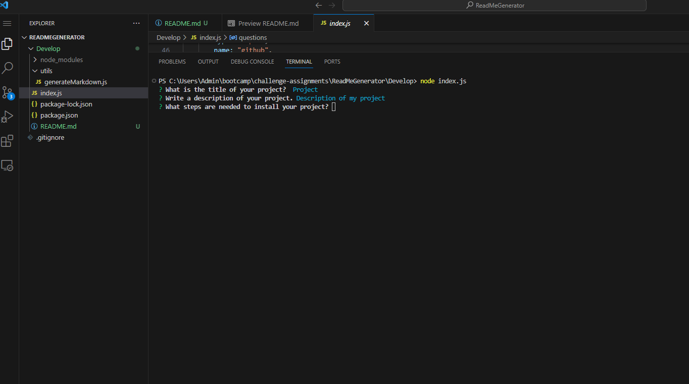

# README Generator

## Table of Contents
- [Description](#description)
- [Installation](#installation)
- [Usage](#usage)
- [License](#license)
- [Questions](#questions)  

## Description
This project was created in order for users to generate a high-quality README by using the command-line.

## Installation
The user should have node downloaded and will need to clone the repository through GitHub. The user should also be using file system and inquirer 8.2.4.

## Usage
Use the command-line and answer the questions set through inquirer. To initiate the questions, the user should type "node index.js" into the command-line. Once all questions have been answered the README will be generated.

Watch the video <a href="https://drive.google.com/file/d/1PdQSNEhrEAcar_UA5GIQoC1cHkd_nUxU/view">here</a>.

## License
This project is licensed under the MIT license.

## Contributing
Please refer to the installation instructions.

## Tests
N/A

## Questions
If you have any questions, please do not hesitate to reach out.
GitHub: [ruledbysaturn](https://github.com/ruledbysaturn)
Email: inramiland@gmail.com
